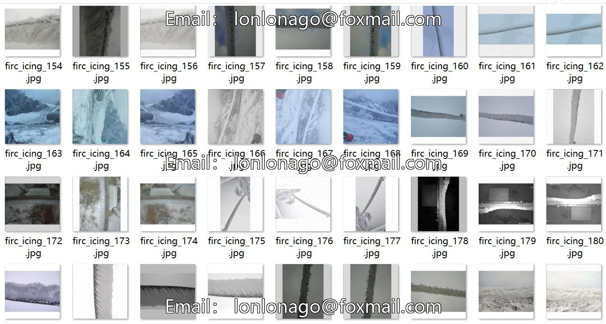
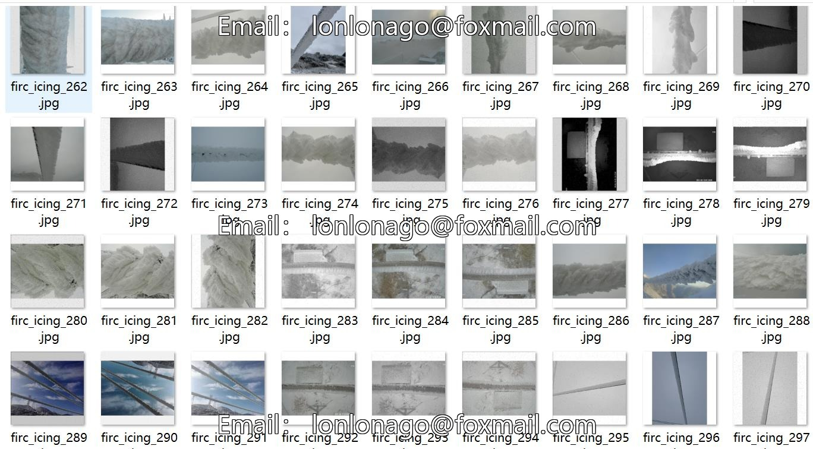
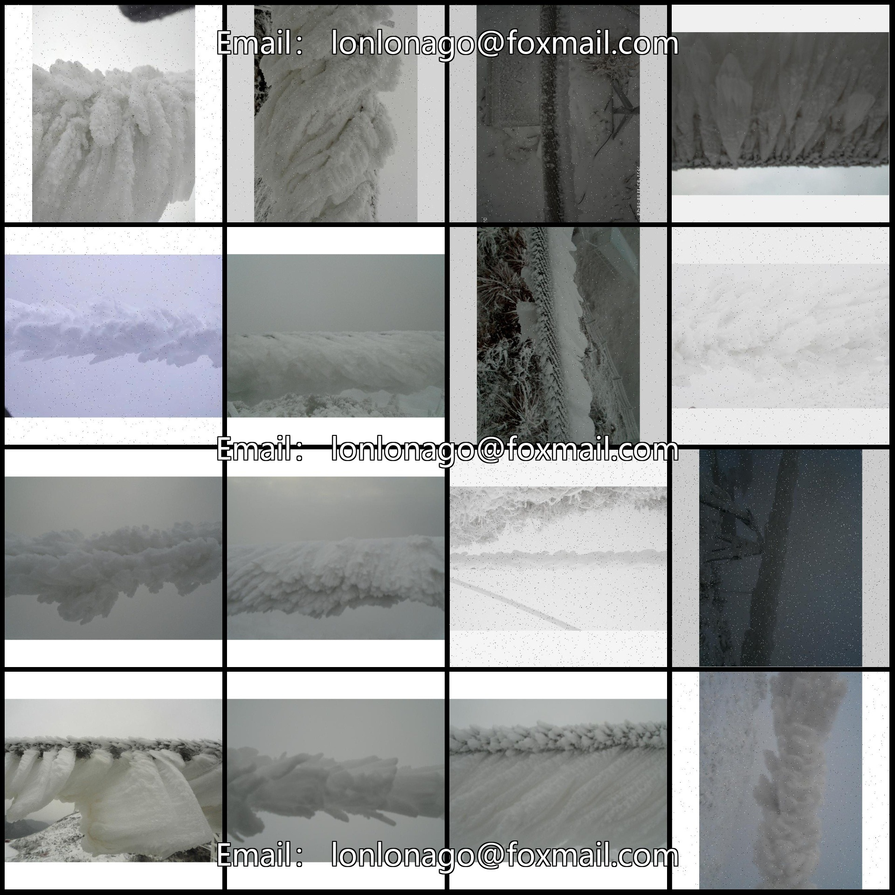
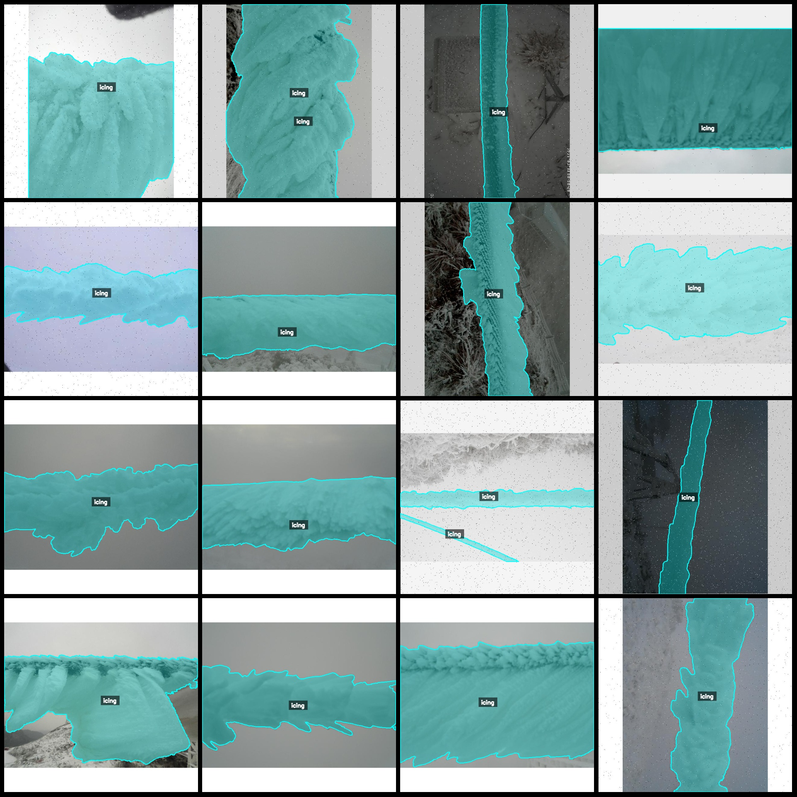
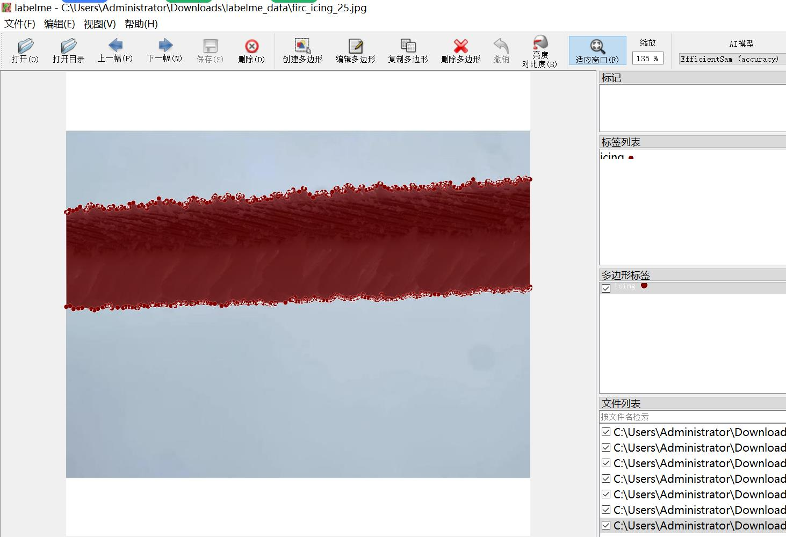

# Power Scene Transmission Line Ice Segmentation Data Set in LabelMe Format: 1138 Images with 1 Category

Dataset Format: LabelMe format (excluding mask files, only including JPG images and corresponding JSON files).
Number of Images (JPG file count): 1138
Number of Annotations (JSON file count): 1138
Number of Annotation Categories: 1
Annotation Category Name: ["icing"]
Number of Boxes per Category: 
icing count = 1280
Total Boxes: 1280
Annotation Tool: labelme=5.5.0
Image Resolution: 640x640
Dataset Enhancement: Yes, mainly noise enhancement
Annotation Rules: Polygons are drawn around the categories
Important Note: The dataset can be edited using labelme, but the JSON dataset needs to be converted into a mask or Yolo format or COCO format for semantic segmentation or instance segmentation.
Special Notice: This dataset does not guarantee the accuracy of the trained models or weight files.
Preview of the images:
Example of the annotation:
Original Image:
Annotation drawing result:
LabelMe editing example image:

## Images

Here is a pay link on Stripe ( https://buy.stripe.com/3cs8yP7sY87d0vu9AB ). Please contact me lonlonago@foxmail.com after funding $89, and I will send you a complete data files , thank you!

